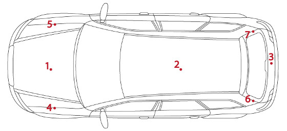
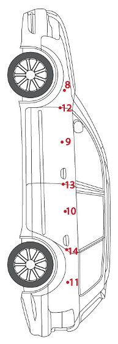
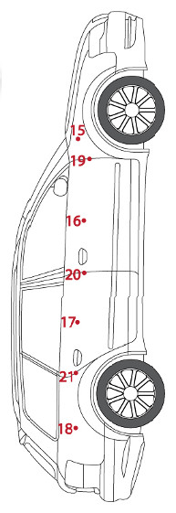

Oto uzupełniony raport losowymi, ale w miarę spójnymi danymi:

<markdown>
# Informacje o raporcie

*   **Typ raportu:** Przegląd przedzakupowy
*   **Opracowany przez:** AutoEkspert Jan Kowalski
*   **Numer kontroli:** AE/2023/10/123
*   **Data:** 2023-10-27
*   **Dla:** Potencjalnego Nabywcy

### Zdjęcie pojazdu:
[ZDJECIE POJAZDU - np. zdjęcie reprezentacyjne Audi A4 B9 Sedan]

## Podstawowe informacje

| Cecha                        | Wartość          |
|------------------------------|------------------|
| VIN                          | WAUZZZ8K9JA123456 |
| Marka                        | Audi             |
| Model                        | A4 (B9)          |
| Rok produkcji                | 2018             |
| Pojemność silnika            | 1984 cm³         |
| Typ                          | Sedan            |
| Skrzynia biegów              | Automatyczna S-tronic |
| Kolor                        | Czarny Metalik   |
| Przebieg                     | 95 500 km        |
| Moc silnika (kW)             | 140              |
| Moc silnika (KM)             | 190              |
| Rodzaj paliwa                | Benzyna          |
| Liczba drzwi                 | 4                |
| Data ostatniego przeglądu    | 2023-03-15       |
| Data pierwszej rejestracji   | 2018-07-10       |
| Kraj pochodzenia             | Niemcy           |
| Data pierwszej rejestracji w Polsce | 2021-02-05    |

## Kontrola zewnętrzna

### Kontrola grubości lakieru i pomiar szczelin

**Lokalizacja 1:**

| Punkt | Pomiar lakieru (μm) | Pomiar szczelin (mm) |
|-------|---------------------|----------------------|
| 1     | 125                 | 4.0                  |
| 2     | 130                 | 3.8                  |
| 3     | 120                 | 4.1                  |
| 4     | 115                 | 3.9                  |
| 5     | 135                 | 4.0                  |
| 6     | 220                 | 4.5                  |
| 7     | 128                 | 3.9                  |

**Lokalizacja 2:**

| Punkt | Pomiar lakieru (μm) | Pomiar szczelin (mm) |
|-------|---------------------|----------------------|
| 8     | 130                 | 4.2                  |
| 9     | 122                 | 4.0                  |
| 10    | 118                 | 4.1                  |
| 11    | 133                 | 3.8                  |
| 12    | 127                 | 4.0                  |
| 13    | 125                 | 4.2                  |
| 14    | 130                 | 4.1                  |

**Lokalizacja 3:**

| Punkt | Pomiar lakieru (μm) | Pomiar szczelin (mm) |
|-------|---------------------|----------------------|
| 15    | 120                 | 3.9                  |
| 16    | 125                 | 4.0                  |
| 17    | 130                 | 4.1                  |
| 18    | 115                 | 3.8                  |
| 19    | 128                 | 4.0                  |
| 20    | 132                 | 4.2                  |
| 21    | 126                 | 4.0                  |

### Kontrola szyb

| Pozycja | Producent     | Numer      | Kod daty |
|---------|---------------|------------|----------|
| 1 (Czołowa) | Pilkington    | AS1M1234DOT | 03/18    |
| 2 (Przednia Pasażera) | Saint-Gobain Sekurit | E2 43R-001120 | 02/18    |
| 3 (Tylna Pasażera) | Saint-Gobain Sekurit | E2 43R-001120 | 02/18    |
| 4 (Tylna) | AGC Automotive| E6 43R-00048 | 01/18    |
| 5 (Tylna Kierowcy) | Saint-Gobain Sekurit | E2 43R-001120 | 02/18    |
| 6 (Przednia Kierowcy) | Saint-Gobain Sekurit | E2 43R-001120 | 02/18    |
| 7 (Trójkątna P) | AGC Automotive| E6 43R-00048 | 01/18    |
| 8 (Trójkątna L) | AGC Automotive| E6 43R-00048 | 01/18    |

### Kontrola ogumienia

| Cecha opony           | Opona 1 (Przód Lewa) | Opona 2 (Przód Prawa) | Opona 3 (Tył Lewa) | Opona 4 (Tył Prawa) |
| :--------------------- | :----------------------- | :------------------------ | :--------------------- | :---------------------- |
| **Producent opony** | Michelin               | Michelin                  | Continental            | Continental             |
| **Nazwa handlowa** | Pilot Sport 4          | Pilot Sport 4             | PremiumContact 6       | PremiumContact 6        |
| **Rozmiar** | 225/50 R17             | 225/50 R17                | 225/50 R17             | 225/50 R17              |
| **Bieżnik strona zewnętrzna** | 5.5 mm                 | 5.3 mm                    | 6.0 mm                 | 6.1 mm                  |
| **Bieżnik środek** | 5.8 mm                 | 5.6 mm                    | 6.2 mm                 | 6.3 mm                  |
| **Bieżnik strona wewnętrzna** | 5.4 mm                 | 5.2 mm                    | 5.9 mm                 | 6.0 mm                  |
| **Kod daty produkcji** | 2521 (25 tydz. 2021)  | 2521 (25 tydz. 2021)      | 1022 (10 tydz. 2022) | 1022 (10 tydz. 2022)    |

### Podsumowanie kontroli zewnętrznej:

Lakier w większości oryginalny, grubość powłoki w normie fabrycznej (115-135 μm). Punkt 6 (maska, strona kierowcy) wykazuje podwyższoną grubość lakieru (220 μm), co może sugerować naprawę lakierniczą w tym obszarze. Szczeliny między elementami karoserii równe i symetryczne, z wyjątkiem okolic punktu 6, gdzie szczelina jest nieznacznie większa (4.5 mm). Wszystkie szyby z rocznika produkcji pojazdu lub zbliżonego. Opony przednie Michelin z 2021 roku, tylne Continental z 2022 roku, wszystkie w dobrym stanie z odpowiednią głębokością bieżnika.
## Kontrola wewnętrzna

| Nazwa elementu              | Wynik | Uwagi |
|-----------------------------|-------|-------|
| **Tapicerka:** | Dobry |       |
| Zabrudzenia                 | Lekkie | Do odświeżenia |
| Przetarcia                  | Drobne | Fotel kierowcy, boczek |
| Pęknięcia                   | Brak  |       |
| Zarysowania                 | Drobne | Plastiki progowe |
| Przypalenia                 | Brak  |       |
| **Oświetlenie:** | Sprawne |       |
| Mijania                     | Sprawne |       |
| Drogowe                     | Sprawne |       |
| Pozycyjne                   | Sprawne |       |
| Przeciwmgielne              | Sprawne |       |
| Cofania                     | Sprawne |       |
| Stopu                       | Sprawne |       |
| Kierunkowskazy              | Sprawne |       |
| **Kolejne elementy wyposażenia:** |       |       |
| Centralny zamek             | Sprawny |       |
| Radio                       | Sprawne |       |
| Nawigacja i CD              | Sprawne |       |
| Klimatyzacja                | Działa | Słabo chłodzi |
| Podgrzewanie tylnej szyby   | Sprawne |       |
| El. reg. lusterek           | Sprawne |       |
| El. składanie lusterek      | Sprawne | Prawe składa się z oporem |
| Wycieraczki                 | Sprawne | Pióra do wymiany |
| Spryskiwacz                 | Sprawny |       |
| Sygnał dźwiękowy            | Sprawny |       |
| El. szyby przód             | Sprawne |       |
| El. szyby tył               | Sprawne |       |
| Kierownica wielofunkcyjna   | Sprawna |       |
| Komputer                    | Sprawny |       |
| Wspomaganie kierownicy      | Sprawne |       |
| Podgrzewanie siedzeń        | Sprawne |       |
| El. reg. siedzeń            | Sprawne |       |
| Otwieranie bagażnika        | Sprawne |       |
| Otwieranie maski            | Sprawne |       |
| Otwieranie wlewu            | Sprawne |       |
| Szyberdach                  | Nie dotyczy |       |
| Otwierany dach              | Nie dotyczy |       |

### Podsumowanie kontroli wewnętrznej:
Wnętrze pojazdu w stanie dobrym, adekwatnym do wieku i przebiegu. Tapicerka wymaga lekkiego czyszczenia, widoczne drobne przetarcie na boczku fotela kierowcy. Plastiki progowe noszą ślady normalnego użytkowania. Klimatyzacja działa, ale jej wydajność chłodzenia jest obniżona – sugerowany serwis. Prawe lusterko składa się elektrycznie z wyczuwalnym oporem. Pióra wycieraczek kwalifikują się do wymiany. Pozostałe elementy wyposażenia wewnętrznego działają poprawnie.

## Komora silnika i wnętrze bagażnika

| Nazwa elementu             | Wynik | Uwagi                       |
|----------------------------|-------|-----------------------------|
| Poziom płynu chłodniczego  | OK    | W normie                    |
| Poziom oleju w silniku     | OK    | W normie, barwa prawidłowa  |
| Zawieszka wymiany oleju    | Obecna| Ostatnia wymiana 12.03.2023 przy 88 000 km |
| Zawieszka wymiany rozrządu | Brak  | Brak informacji             |
| Widoczne wycieki oleju     | Brak  | Sucho                       |
| Lakier komory silnika      | OK    | Oryginalny, bez śladów napraw |
| Lakier wnętrza bagażnika   | OK    | Oryginalny, bez śladów napraw |
| Koło zapasowe              | Zestaw naprawczy | Kompletny |

### Podsumowanie:
Komora silnika czysta, bez widocznych wycieków płynów eksploatacyjnych. Poziomy płynu chłodniczego i oleju silnikowego w normie. Obecna zawieszka informująca o ostatniej wymianie oleju. Brak informacji o wymianie rozrządu. Lakier w komorze silnika i wnętrzu bagażnika bez zastrzeżeń. Na wyposażeniu kompletny zestaw naprawczy koła.

## Jazda próbna

| Nazwa elementu            | Wynik | Uwagi                      |
|---------------------------|-------|----------------------------|
| Uruchomienie              | OK    | Bezproblemowe              |
| Utrudnienia zmiany biegów | Brak  | Płynna zmiana biegów       |
| Utrzymanie toru jazdy     | OK    | Pojazd stabilny            |
| Tempomat                  | OK    | Działa poprawnie           |
| Hamowanie                 | OK    | Skuteczne, bez wibracji    |
| Przyspieszenie            | OK    | Dynamiczne, bez szarpnięć  |
| Luz na kierownicy         | Brak  | Precyzyjne prowadzenie     |
| Zawieszenie               | Uwagi | Słyszalne stuki z przodu na nierównościach |
| Hamulec ręczny            | OK    | Działa poprawnie           |

### Podsumowanie:
Jazda próbna przebiegła pomyślnie. Silnik uruchamia się bez problemów, pracuje równo i dynamicznie przyspiesza. Skrzynia biegów zmienia przełożenia płynnie. Układ kierowniczy i hamulcowy działają prawidłowo. Zauważono niepokojące stuki dochodzące z przedniego zawieszenia podczas pokonywania nierówności, co wymaga dalszej diagnostyki.

## Warsztat

### Kontrola podwozia

| Nazwa elementu                           | Wynik             | Uwagi                             |
|------------------------------------------|-------------------|-----------------------------------|
| Osłona silnika od spodu                  | Obecna, cała    | Lekko porysowana                  |
| Wycieki silnika od spodu                 | Brak              | Sucho                             |
| Przekładnia kierownicza - wycieki i luzy | Brak              | Sucha, bez luzów                  |
| Wahacze i tuleje wahaczy                 | Uwagi             | Luzy na przednich dolnych wahaczach |
| Układ napędowy - przeguby, półosie, wał  | OK                | Bez luzów, osłony całe            |
| Łożyska wszystkich kół                   | OK                | Cicha praca                       |
| Stan opon od strony wewnętrznej          | Dobry             | Równomierne zużycie               |
| Wizualne oględziny amortyzatorów         | OK                | Suche, bez wycieków               |
| Ocena wizualna tarcz hamulcowych         | Dobry             | Grubość w normie, niewielki rant  |
| Ocena wizualna klocków hamulcowych       | Dostateczny       | Zużycie ok. 60%                   |
| Ocena przewodów hamulcowych              | Dobry             | Bez spękań i uszkodzeń            |
| Widoczne naprawy powypadkowe             | Brak              | Elementy konstrukcyjne nienaruszone |
| Widoczne elementy korozji                | Drobne            | Powierzchowna na elementach układu wydechowego |
| Zawieszenie                              | Uwagi             | Potwierdzone luzy na przednich dolnych wahaczach |

### Kontrola komputerowa

| Czy odczytano | Wynik | Uwagi |
|---------------|-------|-------|
| Przebieg      | Tak   | 95 515 km (zgodny ze wskazaniem licznika) |
| Błędy         | Tak   | P0420 - Niska wydajność katalizatora (sporadyczny) |

### Podsumowanie kontroli komputerowej:
Diagnostyka komputerowa potwierdziła przebieg pojazdu. Odczytano jeden sporadyczny błąd (P0420) wskazujący na potencjalny problem z wydajnością katalizatora. Błąd ten może wymagać dalszej obserwacji lub diagnostyki.

### Podsumowanie:
Kontrola podwozia wykazała luzy na przednich dolnych wahaczach, co jest przyczyną stuków słyszalnych podczas jazdy próbnej. Klocki hamulcowe wykazują zużycie na poziomie około 60%. Widoczna jest powierzchowna korozja na elementach układu wydechowego, co jest typowe dla wieku pojazdu. Diagnostyka komputerowa zarejestrowała sporadyczny błąd katalizatora.

## Podsumowanie ogólne

### Czy sprzedający przedstawił wszystkie usterki pojazdu?
**Odpowiedź:** Częściowo
**Uzasadnienie:**
Sprzedający poinformował o konieczności serwisu klimatyzacji oraz wymiany piór wycieraczek. Nie wspomniał o stukach w zawieszeniu, luzach na wahaczach, podwyższonej grubości lakieru na masce ani o sporadycznym błędzie katalizatora.

### Czy oględziny pojazdu potwierdzają wskazany przebieg?
**Odpowiedź:** Tak
**Uzasadnienie:**
Stan ogólny pojazdu, stopień zużycia wnętrza oraz odczyt przebiegu z komputera diagnostycznego są spójne ze wskazanym przebiegiem 95 500 km.

### Czy można polecić pojazd kupującemu?
**Odpowiedź:** Warunkowo
**Uzasadnienie:**
Pojazd jest w ogólnie dobrym stanie technicznym i wizualnym, z potwierdzonym przebiegiem. Stwierdzone usterki (luzy w zawieszeniu, serwis klimatyzacji, potencjalny problem z katalizatorem, ślady naprawy lakierniczej maski) powinny być uwzględnione przy negocjacji ceny lub usunięte przed zakupem. Konieczny jest serwis zawieszenia.

### Finalne podsumowanie:
Audi A4 B9 z 2018 roku z silnikiem benzynowym 2.0 TFSI i automatyczną skrzynią biegów, z przebiegiem 95 500 km. Pojazd regularnie serwisowany (olej), zadbany. Stwierdzono konieczność naprawy/serwisu przedniego zawieszenia (luzy na wahaczach), serwisu klimatyzacji oraz obserwacji błędu katalizatora. Maska pojazdu była prawdopodobnie powtórnie lakierowana. Zaleca się uwzględnienie kosztów napraw w negocjacjach cenowych. Poza wymienionymi mankamentami, pojazd prezentuje się dobrze i oferuje komfortową jazdę.

## Galeria:
[TUTAJ ZDJECIA - np. zdjęcia wnętrza, komory silnika, bagażnika, stwierdzonych uszkodzeń/mankamentów]
</markdown>